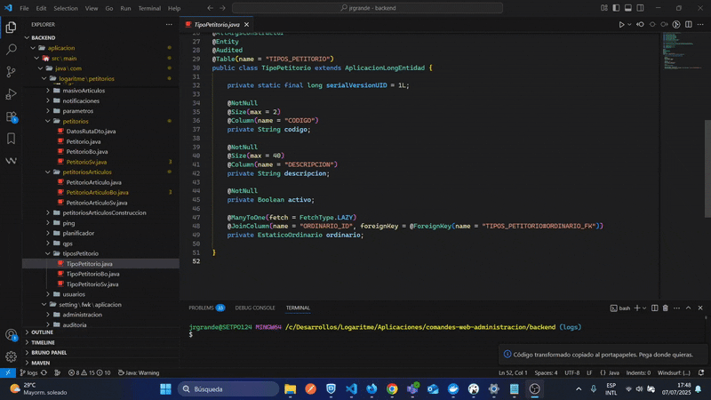

# 🧩 java-to-angular-setting-class

Convierte atributos de clases Java JPA en propiedades TypeScript con decoradores personalizados, adaptados al framework **Setting**.

---

## 🚀 ¿Cómo usar?

1. Selecciona en el editor los atributos de tu clase Java (con o sin anotaciones JPA).
2. Haz clic derecho y selecciona:
   **`Jfwk-to-Afwk`**
3. El código convertido se copia automáticamente al portapapeles.
4. Pégalo en tu clase Angular correspondiente.

---

<!-- ## 🎯 Características principales

✅ Soporta tipos comunes: `String`, `Integer`, `Double`, `LocalDate`, etc.
✅ Reconoce relaciones JPA como `@ManyToOne`, `@ManyToMany`, `@JoinColumn`, `@JoinTable`.
✅ Genera decoradores personalizados:
`@Texto`, `@Numero`, `@Fecha`, `@ObjectId`, `@ArrayObjectId`, `@ArrayEntity`, etc.
✅ Interpreta validaciones como `@NotNull`, `@Size`, `@Digits`. -->

<!-- --- -->
<!--
## 🖼️ Vista rápida

 -->
