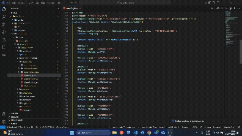

# 🧩 jfwk-to-afwk

Convierte atributos de clases Java JPA en propiedades TypeScript con decoradores personalizados, adaptados al framework **Setting**.

---

## 🚀 ¿Cómo usar?

1. Selecciona en el editor los atributos de tu clase Java (con o sin anotaciones JPA).
2. Haz clic derecho y selecciona:
   **`Jfwk-to-Afwk`**
3. El código convertido se copia automáticamente al portapapeles.
4. Pégalo en tu clase Angular correspondiente.

---

## 🖼️ Vista rápida

